# Arduino Sample Code using Dragino Yun Shield
Sample code for demonstrating simple data logging from DS18B20 Temperature Sensor and Analog photoresistor and then either storing in MySQL database or tweeting the values using the Twitter API.

The difference with this code is that it uses the Dragino Yun Shield...

## Dragino Yun Shield  

	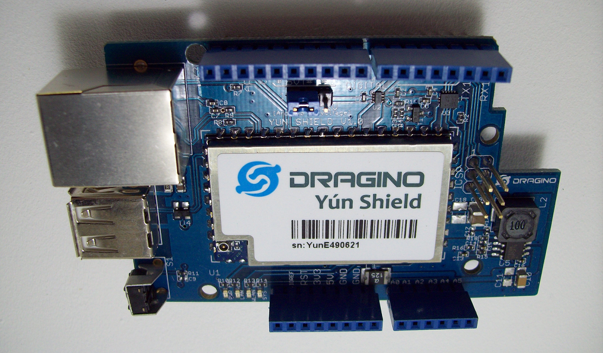

## How do I configure the Dragino Yun Shield and the Arduino UNO Code to work together?
<ol>
	<li>Jumper pins 1/2 (closest to the reset button) of the ICSP header on the Arduino UNO board
		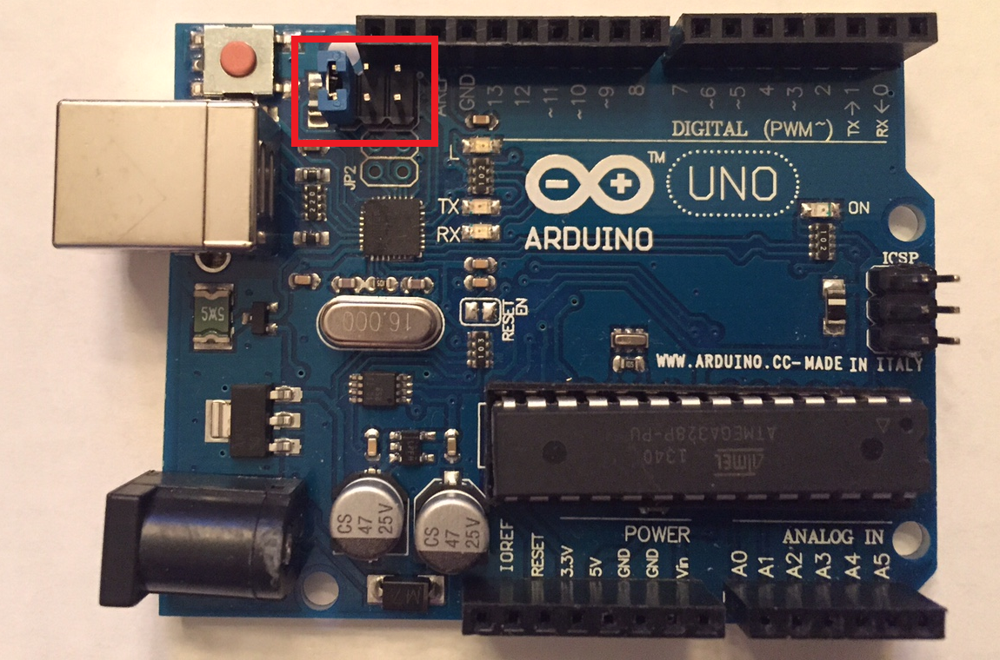</li>
	<li>Connect the Dragino Yun Shield to the Arduino UNO</li>
	<li>Power the boards using a DC power supply ~+7v-+15v</li>
	<li>Connect to Yun Shield -- At the first boot of Yun Shield, it will auto generate an unsecure WiFi network call Draginox-xxxxxx. Use your laptop to connect to this WiFi network. The laptop will get an IP 192.168.240.xxx and the Yun Shield has the default IP 192.168.240.1 
	

	<table>
	<tr>
	<td>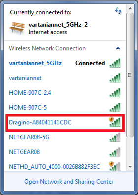</td>
	<td>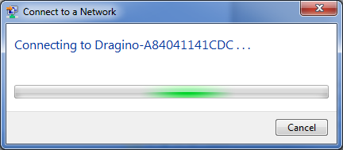</td>
	<td>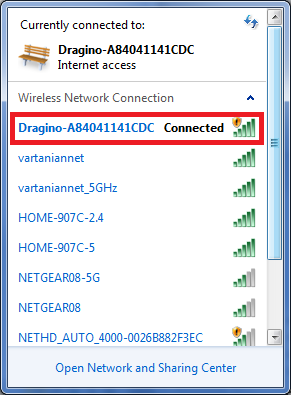</td>
	</tr>
	</table>
	

	</li>
	<li>Set Up Yun Shield to access Internet - After joining the network, the settings homepage will ask for password (the default password is dragino). After login,the GUI will show the WIFI / ETH interface status. 
	

	<table>
	<tr>
	<td>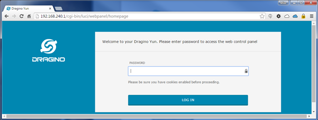</td>
	<td>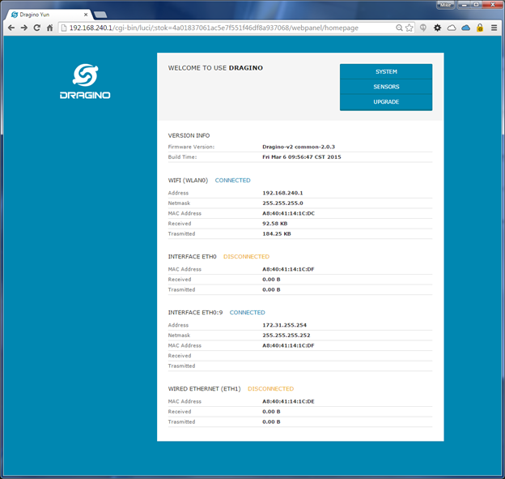</td>
	</tr>
	</table>
	

	</li>
	<li>Click the SYSTEM button and now user can configure Yun Shield to access internet via your WiFi router.
	

	<table>
	<tr>
	<td>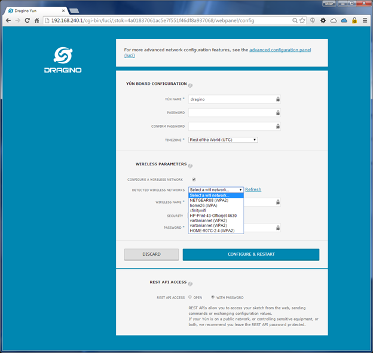</td>
	</tr>
	</table>
	

	</li>
	<li> Add Dragino Yun Shield Board Configurations - grab the boards.txt file from https://github.com/dragino/modules/blob/master/hardware/YunShield/sketchbook/hardware/YunShield/avr/boards.txt and insert the code below into the <yourpathtoArduino>/Arduino/hardware/arduino/avr/boards.txt file.
<pre> unoyun.name=Arduino Uno -- Dragino Yún
 unoyun.upload.via_ssh=true

 unoyun.vid.0=0x2341
 unoyun.pid.0=0x0043
 unoyun.vid.1=0x2341
 unoyun.pid.1=0x0001
 unoyun.upload.tool=avrdude
 unoyun.upload.protocol=arduino
 unoyun.upload.maximum_size=32256
 unoyun.upload.maximum_data_size=2048
 unoyun.upload.speed=57600
 unoyun.upload.disable_flushing=true
 unoyun.upload.use_1200bps_touch=true
 unoyun.upload.wait_for_upload_port=true

 unoyun.bootloader.tool=avrdude
 unoyun.bootloader.low_fuses=0xff
 unoyun.bootloader.high_fuses=0xde
 unoyun.bootloader.extended_fuses=0x05
 unoyun.bootloader.file=optiboot/optiboot_atmega328.hex
 unoyun.bootloader.unlock_bits=0x3F
 unoyun.bootloader.lock_bits=0x0F

 unoyun.build.mcu=atmega328p
 unoyun.build.f_cpu=16000000L
 unoyun.build.board=AVR_YUN
 unoyun.build.core=arduino
 unoyun.build.variant=standard</pre></li>.
	<li>Detect Yun Shield -- Assuming your laptop and Yun Shield are in the same network, the Yun Shield will broadcast data in this network and Arduino IDE will receive this data and show the Yun Shield in <i>Tools>Port</i>.</li>
	<li>Add/replace libraries -- Compared to the WiFi/Ethernet equivalent code, we need to make a few changes to the code to get it to work with the Dragino YUN SHIELD. First we need to add the Bridge and Console libraries. Second we need to replace the WiFi/Ethernet library includes with the Yun Client and Yun Server libraries.
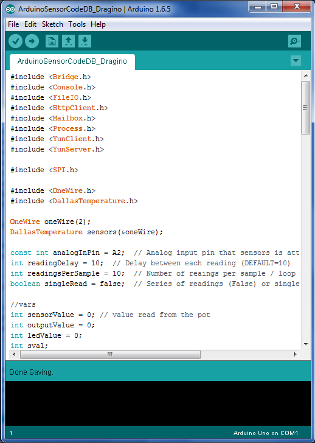</li>
Third, replace the WiFi/Ethernet client declaration with a YunClient declaration.
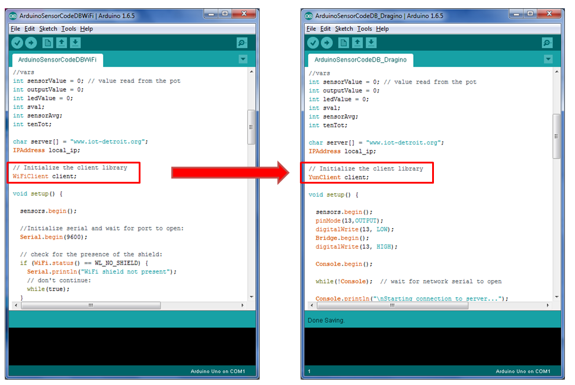 And fourth, replace the serial calls with console calls.
	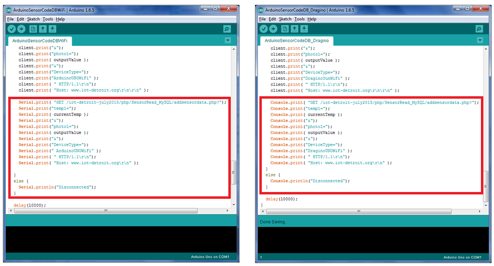</li>
</ol>
